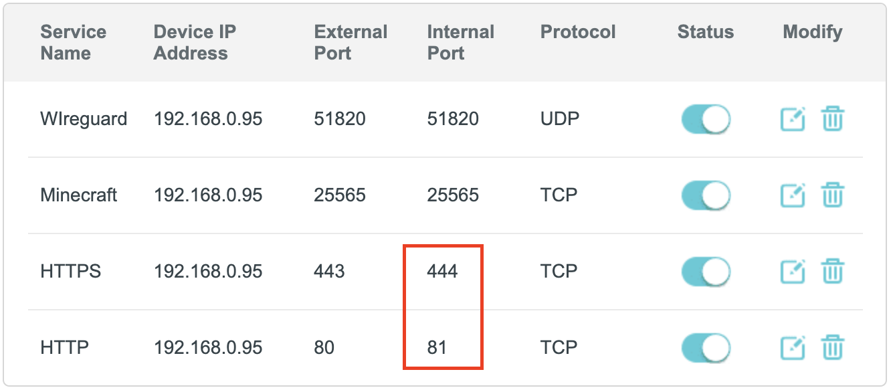
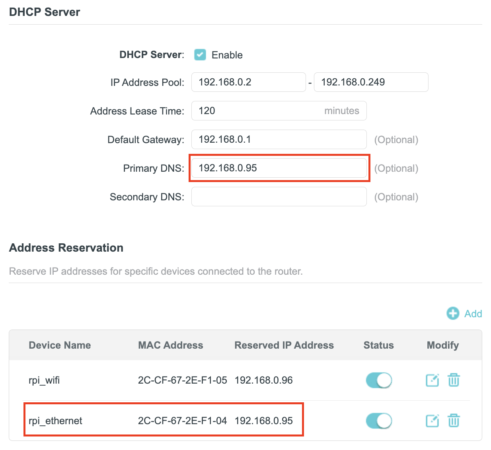

# Home Server with Traefik Proxy

Welcome to my home server configuration!

This configuration will assist you in setting up your own home server using Traefik as a reverse proxy and docker-compose to manage your services. With Traefik, you can effortlessly manage routing, load balancing, and SSL/TLS termination for your web services.
## System Requirements

Before you begin, ensure that your system meets the following requirements:

- **Docker:** Ensure Docker is installed on your system. If not, download it from [Docker's official website](https://www.docker.com/get-started/).
- **apache2-utils**: Make sure apache2-utils is installed on your system. If not, execute the following command in your terminal:
    ```bash
    sudo apt update
    sudo apt install apache2-utils
    ```
- **Make:** Make sure you have Make installed on your system. Make is typically available on Unix-like operating systems. If Make is not installed, you can install it using the following command:
    ```bash
    sudo apt update
    sudo apt install make
    ```


## Getting Started

Follow these steps to get started with your Traefik Home Server:

### Clone Repository 

### Create .env file
Copy the `.env.example` file and rename it to `.env`. Execute the following command in your terminal:
      ```
      cp .env.example .env
      ```
### Traefik with internal services without "Your connection is not private" warning

To use Traefik with internal (local) services without browser security warnings, you need to set up local trusted certificates. Follow these steps:

#### 1. Set the LOCAL_DOMAIN environment variable in your `.env` file:
`LOCAL_DOMAIN=your-local-domain.local`

This domain will be used for all your internal services.

#### 2. Generate local certificates by running the following command:
  ```bash
    make localCerts
  ```

This command will:

- Build and run a Docker container that generates trusted SSL certificates for your local domain.
- Create certificates for both your main domain and wildcard subdomains (*.your-local-domain.local).
- Save certificates in the `traefik/localCerts` directory.
- Create a TLS configuration file in `traefik/dynamic/local-tls.yml`.
- Display instructions for installing the root certificate on your client devices.

#### 3. Install the root certificate on your client devices
**On macOS:**
  ```bash
    # First, copy the certificate from your server (if needed)
    scp username@server-ip:~/server/traefik/localCerts/rootCA.pem ~/Downloads/
    
    # Install the certificate
    sudo security add-trusted-cert -d -r trustRoot -k /Library/Keychains/System.keychain ~/Downloads/rootCA.pem
  ```
**On Windows:**
- Copy the `rootCA.pem` file to your Windows machine
- Rename it to `rootCA.crt` if Windows cannot recognize the file type
- Double-click the file to open the certificate installer
- Select "Local Machine" and click "Next"
- Choose "Place all certificates in the following store"
- Select "Trusted Root Certification Authorities"
- Complete the installation

#### 4. Restart your browser to apply the changes.

After completing these steps, you can access your local services using HTTPS (https://service.your-local-domain.local) without any security warnings in your browser.

**Note:** If you add new devices to your network, you'll need to install the root certificate on them as well to avoid security warnings


### Traefik with external services and Let's Encrypt

To enable external services and obtain SSL/TLS certificates from Let's Encrypt, you need to perform the following steps:

**You need to set the environment variables in the `.env` file:**
- `EXTERNAL_DOMAIN` - the domain name that will be used to access external services.
- `ROOT_EMAIL` - the email address that will be used for registering Let's Encrypt certificates.

**Also, to obtain SSL/TLS certificates, you need to choose and configure a challenge**

***DNS Challenge***

If you use Cloudflare as your DNS provider, then I recommend using the DNS challenge to obtain certificates. To do this, you need to set the following environment variables in the `.env` file:
- `CLOUDFLARE_EMAIL` - the email address used to log into Cloudflare.
- `CLOUDFLARE_DNS_API_TOKEN` - the API key that can be created on your Cloudflare profile page.

If you use another DNS provider, you can check its support in the [official Traefik documentation](https://doc.traefik.io/traefik/https/acme/#providers).

If your provider is not supported, you will have to use the HTTP challenge.

***HTTP Challenge***

To use the HTTP challenge, you need to uncomment the lines configuring the `HTTP Challenge` in the `traefik/docker-compose.traefik.yml` file and comment out the lines configuring the `DNS Challenge`.

Also, for the HTTP challenge, you need to have port 80 open on your router. More about this below.


> **Warning!** To enable staging for Let's Encrypt to avoid hitting rate limits, uncomment the line with the `caServer` setting in the `traefik/docker-compose.traefik.yml` file. When you're ready to obtain real certificates, remember to comment out or remove this line.

### Configure Traefik dashboard

- To add authentication to Traefik dashboard, generate a password hash for the user by executing the following command in your terminal:
  ```
  echo $(htpasswd -nb "<USER>" "<PASSWORD>") | sed -e s/\\$/\\$\\$/g
  ```
- Copy the username and the generated hash and paste them into the `TRAEFIK_USER` and `TRAEFIK_HASHED_PASSWORD` variables in the `.env` file.

### External and internal services

In this configuration, there is a separation between external and internal services. External services are accessible from the Internet, and internal ones only from the local network.

To separate internal and external services, 4 entry points were created:
- `web` -  entry point for internal services that are only accessible from the local network. **Port 80.**
- `websecure` -  entry point for internal services that are only accessible from the local network over HTTPS. **Port 443.**
- `web-external` - entry point for external services that are accessible from the internet. **Port 81.**
- `websecure-external` - entry point for external services that are accessible from the internet over HTTPS. **Port 444.**

### Port Forwarding

To enable external services, you need to set up port forwarding on your router. Port forwarding should be configured as follows:
- Port `81` -> Port `80` of your server
- Port `444` -> Port `443` of your server

Also, you need to set up port forwarding for external services that will use ports different from HTTP and HTTPS.

For example, WireGuard uses port 51820 and UDP protocol; to make it work, you need to set up port forwarding:
- Port `51820` -> Port `51820` of your server

Minecraft server uses port 25565 and TCP protocol; to make it work, you need to set up port forwarding:
- Port `25565` -> Port `25565` of your server



## Pi-Hole
In this configuration, Pi-Hole is used as a local DNS server and ad blocker.

To use Pi-Hole, you need to set up your server as the DNS server on your router.
1. Log into your router's admin panel.
2. Go to DHCP Server settings.
3. Reserve an IP address for your server so it does not change in the future.
4. Set the IP address of your server as the primary DNS server. Leave the secondary and tertiary DNS servers empty.
5. Save the settings and reboot the router.



Also, it's important to configure local domains in Pi-Hole. To do this, you can use the Pi-Hole admin panel and go to the `Local DNS` tab.

But the most convenient way is to create a wildcard entry for your local domain, so you don't have to add each subdomain manually.

To do this, create a file `02-my-wildcard-dns.conf` in the directory `./pihole/etc-dnsmasq.d/` and add the following entry:
```
address=/mydomain.local/192.168.0.95
```
Where `mydomain.local` is your local domain, and `192.168.0.95` is the IP address of your server.

## WireGuard
WireGuard is a fast and modern VPN protocol that provides secure connection to your home server from anywhere in the world.

By connecting to your server via WireGuard, you get access to the local network and internal services from anywhere in the world.

Moreover, on a device connected to WireGuard, there will be no ads even over LTE :)

You can set up peers that will be created initially in the file `./wireguard/docker-compose.wireguard.yml` by changing the environment variables `PEERS`.
You can also add new peers via the console inside the `wireguard` docker container.

Connection data for WireGuard can be found in the file `./wireguard/config/peer_name`.

Remember to create a DNS record with the subdomain `wg` for your WireGuard server, so you can connect to it by domain name.

> **Warning!** If you use Cloudflare as your DNS provider, DO NOT use Cloudflare DNS Proxy for the subdomain `wg`, as WireGuard does not work through a proxy.

### DNS Configuration

Add DNS records for the subdomains that will be used to access the external services. For example, if you want to use the subdomain "api", add a DNS record for this subdomain on your DNS provider's website. After that, modify the subdomain in the `docker-compose.servicename.yml` file.

### Utilize Makefile

Utilize the provided Makefile for streamlined command execution. Run `make help` in your terminal to view a list of available commands along with their descriptions.

## Adding Services

To add a new service to your Traefik setup, follow these guidelines:

**For Docker-based Services:**

Create a separate directory for each service following this structure:
```plaintext
    service/
    ├── conf
    │   └── ...
    ├── data
    │   └── ...
    ├── docker-compose.servicename.yml
    ├── logs
    │   └── ...
    └── README.md
```

By following this structure, you can easily manage and scale your services within Traefik. Each service will have its own `docker-compose.servicename.yml` file, which will be used to define the service's configuration.
Don't forget to add the service to the base `docker-compose.yml` file in the root directory of this repository.

**For Non-Docker Services:**

If you want to add a service that doesn't use Docker, you can still integrate it with Traefik by adding its dynamic configuration YAML files to the `traefik/dynamic` directory. Traefik will automatically detect and configure these services based on the provided configuration files.
